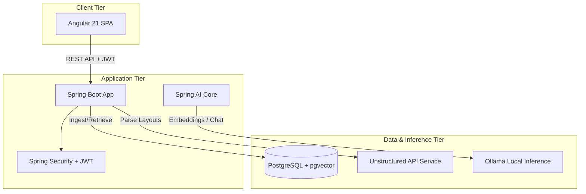

# PrivaDoc AI 🛡️🤖

**PrivaDoc AI** is a secure, self-hosted Document Retrieval-Augmented Generation (RAG) assistant. It allows teams to upload sensitive documents, automatically parse them with high-fidelity layout analysis, store vector embeddings in a pgvector database, and perform context-aware private Q&A using locally-running Large Language Models (LLMs) via Ollama.

---

## 🌟 Key Features

*   **🔒 Complete Data Privacy**: Operates entirely offline using local LLMs (via Ollama) and self-hosted databases. No document content ever leaves your infrastructure.
*   **📂 Multi-Modal Document Parsing**: Leverages the high-resolution parsing capabilities of the **Unstructured API** to ingest multi-format files (PDFs, TXT, DOCX, etc.) while preserving structural context (like section titles).
*   **⚡ Contextual Vector Search**: Chunks documents dynamically and stores their mathematical representations inside **PostgreSQL with the `pgvector` extension** using the `nomic-embed-text` embedding model.
*   **👥 Tenant-like Collaboration Groups**: Organize documents and chats into Groups. Access control is enforced at the database level so users can only chat with documents in groups they are active members of.
*   **💬 History-Aware Q&A**: Automatically reformulates follow-up chat messages into standalone queries by analyzing the context of recent conversation history before performing similarity search.
*   **🚀 Modern SPA Dashboard**: A responsive Angular 21 Single Page Application featuring group managers, member role management, real-time ingestion status indicators, and an interactive chat interface.

---

## 🏗️ Architecture

PrivaDoc AI uses a modern multi-tier microservices architecture designed to prioritize privacy and scalability:



### Component Details
1.  **Frontend (Angular 21)**: Captures user interaction, handles upload streams, and renders markdown answers with reference citations.
2.  **Backend (Spring Boot 3.5)**: Orchestrates authentication (JWT), file storage, and the RAG pipeline. It leverages **Spring AI** to interface with Ollama.
3.  **Vector Database (PostgreSQL + pgvector)**: Acts as both the relational database (for users, groups, sessions, and messages) and the semantic storage for document vector chunks.
4.  **Document Parser (Unstructured API)**: Analyzes document layouts to separate titles, text, tables, and headers for smarter chunking.
5.  **Local LLM Engine (Ollama)**: Generates embeddings using `nomic-embed-text` and processes Q&A answers using local models (default configured: `gemma4`).

---

## 🛠️ Local Setup & Run Guide

Follow these steps to run PrivaDoc AI on your local machine.

### Prerequisites
Make sure you have the following installed on your machine:
*   [Docker Desktop](https://www.docker.com/products/docker-desktop/)
*   [Java 17 JDK or higher](https://adoptium.net/)
*   [Node.js (v20+) & npm](https://nodejs.org/)
*   [Ollama](https://ollama.com/)

---

### Step 1: Start the Local LLM (Ollama)
1. Install and start Ollama on your machine.
2. Download the required embedding and chat models by running the following commands in your terminal:
   ```bash
   ollama pull nomic-embed-text
   ollama pull gemma4
   ```
   *(Note: You can change the models by updating `spring.ai.ollama.chat.options.model` and `spring.ai.ollama.embedding.options.model` inside `privadocai/src/main/resources/application.properties`.)*

---

### Step 2: Spin Up the Infrastructure Containers
We use Docker Compose to run PostgreSQL (with `pgvector`) and the `unstructured-api` container.

From the root directory of the project, run:
```bash
docker-compose up -d postgres-vector unstructured-api
```
This command starts:
*   **Postgres Database** on port `5432` with username `priva-admin`, password `Ldwpe30idn03@#`, and database `priva-db`.
*   **Unstructured API** on port `8001` (internally port `8000`).

---

### Step 3: Start the Backend (Spring Boot)
1. Navigate to the backend directory:
   ```bash
   cd privadocai
   ```
2. Run the application using Gradle:
   *   **On Windows (PowerShell/CMD):**
       ```powershell
       ./gradlew.bat bootRun
       ```
   *   **On Linux/macOS:**
       ```bash
       ./gradlew bootRun
       ```
The backend server will start running on `http://localhost:8080`. The database tables and VectorStore schema will be initialized automatically on the first startup.

---

### Step 4: Start the Frontend (Angular)
1. Navigate to the client directory:
   ```bash
   cd ../client
   ```
2. Install the frontend dependencies:
   ```bash
   npm install
   ```
3. Start the Angular development server:
   ```bash
   npm run dev
   ```
   *(Or run `npx ng serve`)*

Open your browser and navigate to `http://localhost:4200` to access the application.

---

### 🐳 Option: Running the Entire Stack via Docker Compose
If you prefer not to install Node.js and Java locally, you can run the entire application inside Docker containers.

1. Ensure Ollama is running on your host machine and accessible.
2. From the root directory, run:
   ```bash
   docker-compose up --build -d
   ```
3. The frontend will be accessible at `http://localhost:4200` and the backend api at `http://localhost:8080`.

---

## 🔒 Security & Verification Details
*   All endpoints under `/api/chat/**` and `/api/document/**` require a valid JWT header (`Authorization: Bearer <TOKEN>`).
*   User permissions are validated to ensure users cannot upload, delete, ingest documents, or initiate chats in groups where they are not active members.
*   Document files are stored locally in the directory specified by `app.storage.upload-dir` (default: `./documents`).
